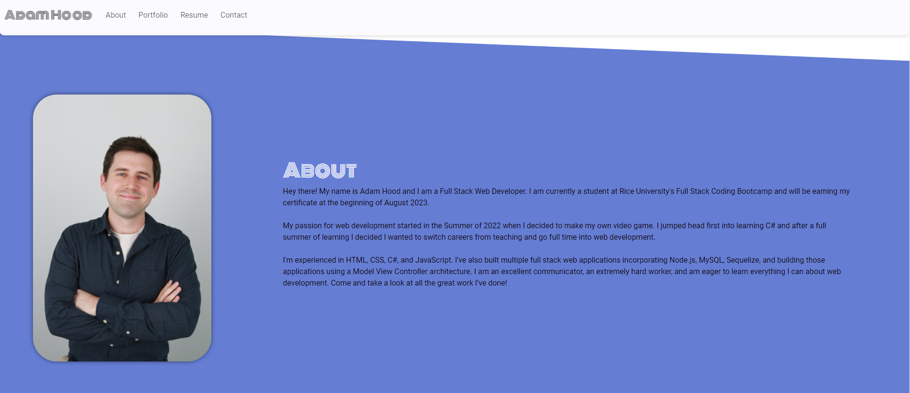

# README Generator
  
  ## Description
  Portfolio Part II is my new and updated portfolio to display some of the skills I have learned during my time in the Rice Coding Bootcamp. This was the very first React Application that I built from start to finish and while challenging at times I found the experience to be very rewarding. 
  

  ## Table of Contents
  * [Installation](#installation)

  * [Usage](#usage)

  * [License](#license)

  * [Contributing](#contributing)

  * [Tests](#tests)

  * [Questions](#questions)

  * [Credits](#credits)

  

  ## Installation
  Clone the repository onto your local machine. Open the file in your preferred code editor. Open an integrated terminal for the index.js file. 
  
  To install dependencies, run the following command in the command line npm i.
  
  ## Usage
  After cloning the repo and installing all dev dependencies, you can run the application by typing in npm run start which will open up a browser for you to view.

  
  
  
  ## License
  Notice: This application is covered under the  license.

  Link: https://img.shields.io/static/v1?label=License&message=MIT&color=$blue

  ## Contributing
  At this time there are no plans to include contributions to this project. 

  
  ## Questions
  Please reach out to me below if you have any questions.

  
  GitHub: [adamhood15](https://github.com/adamhood15)

  Email: adamhood15@gmail.com
  
  ## Credits
  I am the sole collaborator on this project. Rice University provided the starter code. 